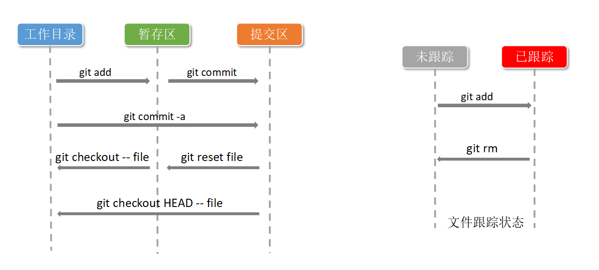

[TOC]


### git 工作流程图



***

### 文件
+ .ignore
+
```bash
[remote "origin"]
    url = https://github.com/jiuguai/test.git
    fetch = +refs/heads/*:refs/remotes/origin/*
[branch "master"]
    remote = origin
    merge = refs/heads/master

```

### 初始化配置

    git config --global user.name zero
    git config --global user.email 
    git config --list
    存储账号密码
    git config --global credential.helper store

    git init
    git init --bare //裸露的仓库 无工作区域

    git status

### 远程仓库
    //生成 ssh 密钥、公钥
    ssh-keygen -t rsa -C
    
    git clone
    提交
    git push https://github.com/jiuguai/test.git master
    给远程仓库起别名
    git remote add gitname [url]
    git push gitname master
    //下载
    git pull git@github.com:jiuguai/test.git ask_branch:ask_branch

    //删除远程分支
    git push origin --delete ask_branch

### config 文件可以添加
        [remote "origin"]
            url = https://github.com/jiuguai/test.git
            fetch = +refs/heads/*:refs/remotes/origin/*
        [branch "master"]
            remote = origin
            merge = refs/heads/master


### 忽略规则

    .gitignore
    echo '*.o' >> .gitignore
    > .gitignore
    echo 'out/' >> .gitignore

******
### 命令
####git add

    git add filename 
    git add .           #不包括删除文件
    git add -u          #不会提交新文件
    git add -A          #. -u 的综合体
    git add *.txt


####git commit

    git commit -m 'first'
    git commit -m 'second' test.txt


    //一次性提交
    git commit -am 'headname' [filenames]
  
    //修正上一次提交
    git commit --amend 
    //追加
    git commit -C head -a --amend

    //查看提交信息
    git log
    git log --oneline

####git reset
    git reset --[mixed|soft|hard] HEAD~5
    git reset 7f33013

    回滚文件 HEAD 指针不移动

#### git diff
    比较工作区和暂存区
    git diff

    比较两个快照
    git diff 7f33013 7fwd013

    工作区和快照比较
    git diff 7f33013

    暂存区与快照比较
    git --cached [7f33013]

#### git rm
    git rm filename
    git rm --cached filename
    git rm -f filename


#### git mv
    git mv oldfile newfile

#### git checkout

    从暂存区还原到工作区 
    如果暂存区没有就从提交head头获取
    git checkout [head|branch_addr]-- t1.txt

******
### git分支
####查看    
    git branch [-a]
    git log --decorate --oneline --graph --all

#### 创建
    git branch dev
    
#### 切换
    git checkout dev
####创建并切换分支
    git checkout -b bran_name

#### 搭配stash    
    切换分支如果本来分支有未提交 要不提交要不使用以下命令
    git stash stashname
    切回来时候使用如下命令
    //查看
    git stash list
    //还原
    git stash apply stash@{num}
    //删除stash
    git stash drop stash@{num}

####   删除      
    //切换到另一个分支才可以删除
    git branch -d dev
    
#### 修改分支名
    git branch -m dev fix_name

####git merge
    git  merge dev [--no-commit]
    解决冲突后
    git commit -am 'mergeversion'
####git rebase  
    #replace base
    业务场景 分支处理冲突
    ask   $ git rebase master
    再交给住分支合并
    master $ git merge  ask


