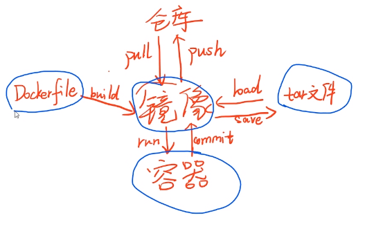

+ 当前关心
    + 2020年5月13日
    
        docker ps
        docker images
        docker run -d -p 宿主端口:容器端口 --name 容器名 image
        docker exec -it container_id |container_name bash # 交互
        
        docker rm $(docker ps -a -q) # 删除所有的容器
        docker kill container_name

        docker exec -it container_id |container_name bash 
        docker inspect 容器ID | grep IPAddress

        # 查看容器IP
        docker inspect -f='{{.Name}} {{.NetworkSettings.IPAddress}} {{.HostConfig.PortBindings}}' $(docker ps -aq)
        docker inspect --format='{{.Name}} - {{range.NetworkSettings.Networks}}{{.IPAddress}}{{end}}' $(docker ps -aq)

+ 查看
    + 镜像
        docker images [OPTIONS] [REPOSITORY[:TAG]]
            OPTIONS说明：

            -a :列出本地所有的镜像（含中间映像层，默认情况下，过滤掉中间映像层）；

            --digests :显示镜像的摘要信息；

            -f :显示满足条件的镜像；

            --format :指定返回值的模板文件；

            --no-trunc :显示完整的镜像信息；

            -q :只显示镜像ID。
    + 容器
        docker ps [OPTIONS]
            OPTIONS说明：

            -a :显示所有的容器，包括未运行的。

            -f :根据条件过滤显示的内容。

            --format :指定返回值的模板文件。

            -l :显示最近创建的容器。

            -n :列出最近创建的n个容器。

            --no-trunc :不截断输出。

            -q :静默模式，只显示容器编号。

            -s :显示总的文件大小。

+ 删除
    + 容器
        docker kill 