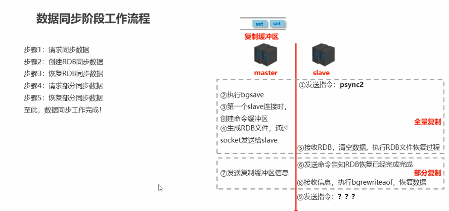

+ 建立连接
    + slave client
        slaveof master-ip master-port
        # 配置文件中写上
        masterauth password
    
    + slave server
        redis-server conf-path --slaveof master-ip master-port

    + 配置文件
        masterauth password
        slaveof master-ip master-port
    
    + 实验
        * 修改配置文件
            
            logfile logpath # 注释 此条
            damemonize no

+ 同步
    + 配置
        repl-backlog-size 1mb # 命令缓存区大小

        slave-serve-stale-data yes|no # slave 进行同步时候 是否可以修改数据

    + 同步过程

