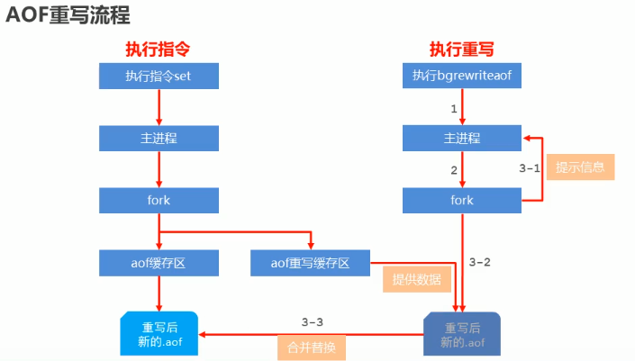
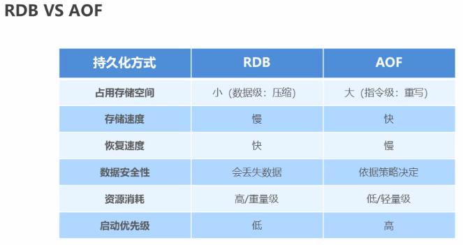

+ 持久化类型
	RDB
	AOF

+ RDB
	+ 命令行
		save

		debug reload # 重启

		shutdown save # 关闭服务器时保存数据

	+ 配置文件
		+ dbfilename dump-port.rdb

		+ dir

		+ rdbcompression yes
			说明：是否压缩
			经验：默认开启，如果no 可以节省cpu时间，采用LZF压缩

		+ rdbchecksum yes
			说明：进行校验，读写过程中进行
			经验：通常开启，如果为no，可节约读写性10%时间，但是存在风险

		+ stop-writes-on-bgsave-error yes
			说明:后台存储过程中如果出现错误现象，是否停止保存操作
			经验:默认开启 

		+ save second changes # 执行bgsave

+ AOF

	+ 命令

		+ bgrewriteaof  # aof 重写

	+ 策略
		+ always

		+ everysec (每秒)

		+ no （系统控制)

	+ 配置文件
		+ appendonly yes|no
		+ appendfsync always|everysec|no

		+ auto-aof-rewrite-min-size size
		+ auto-aof-rewrite-percentage percentage

+ 对比

