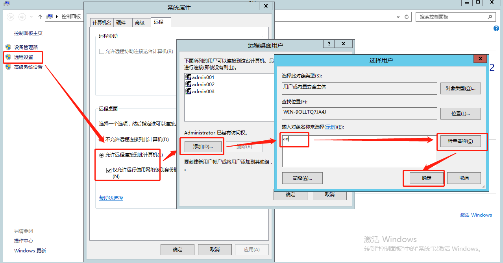
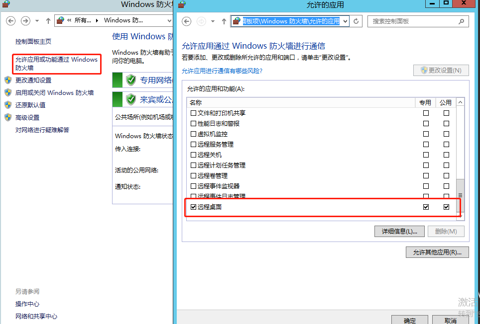
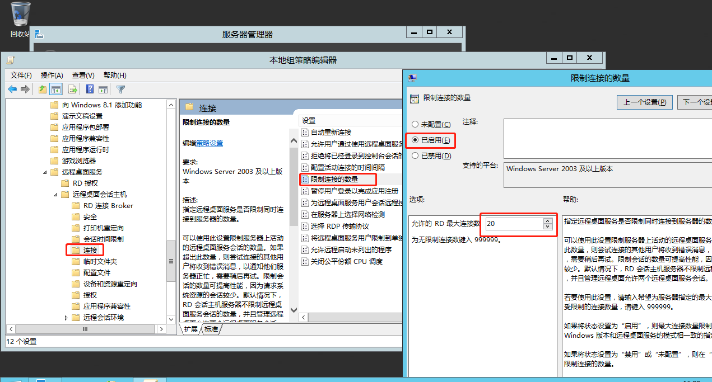
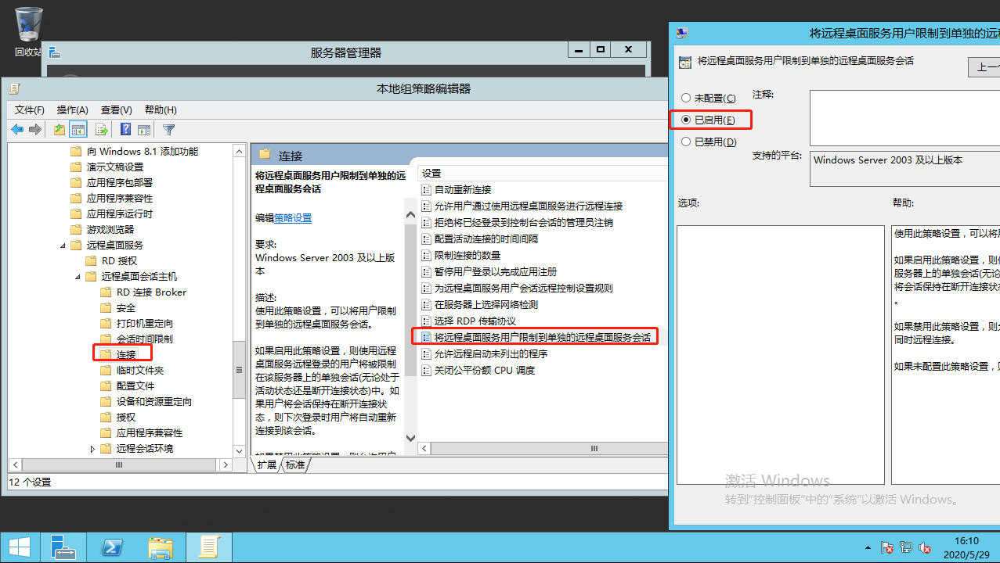
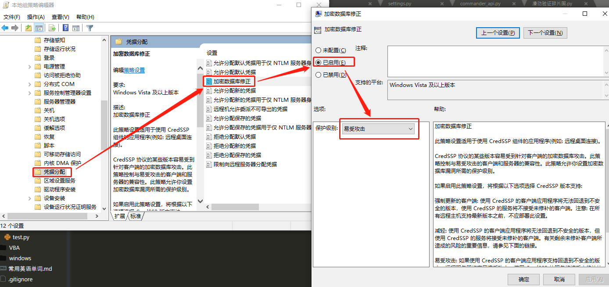

+ 添加用户

    admin001

    admin002

+ 将用户设置为可远程访问
    
    

+ 关闭防火墙或自己写入站

    

+ gpedit.msc
    + 计算机配置—>管理模板—>windows组件—>
        远程桌面服务—远程桌面会话主机—连接
    

    
    

+ 本地远程连接注意
    + 计算机配置—>管理模板—>系统—>
        凭据分配—>*数据库修正

    

