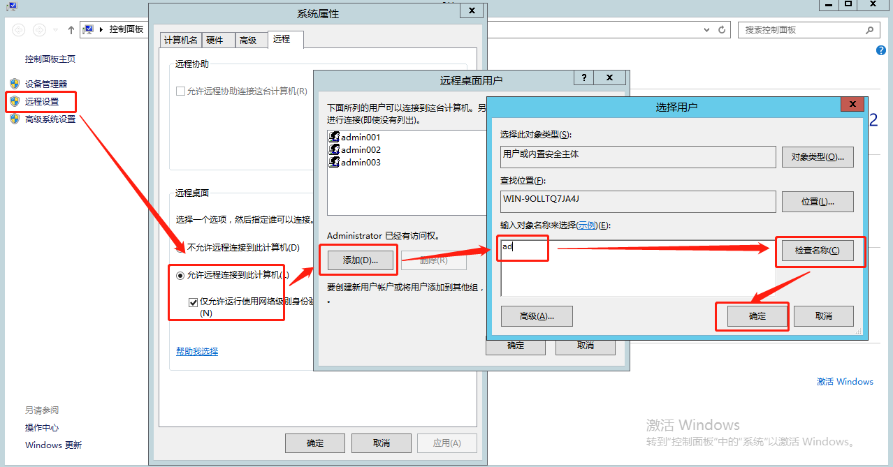
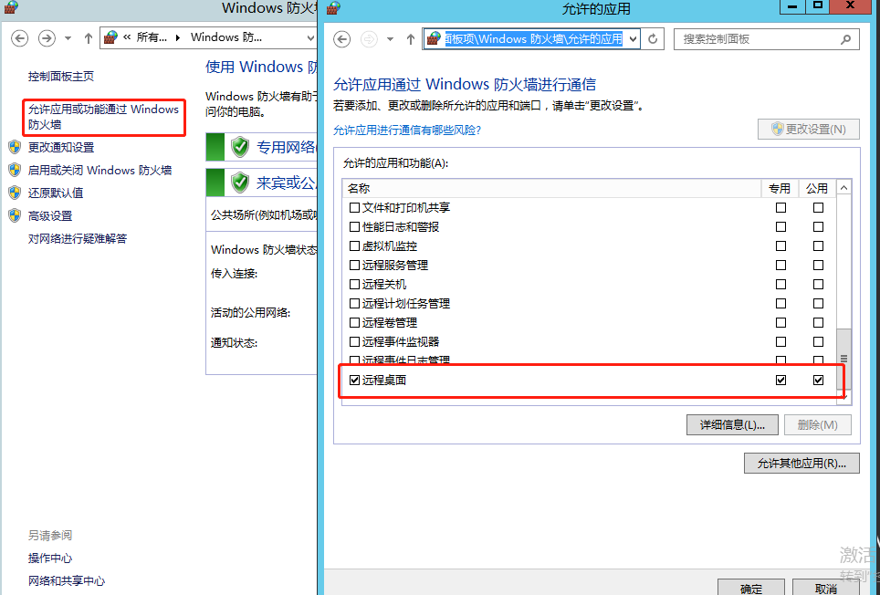
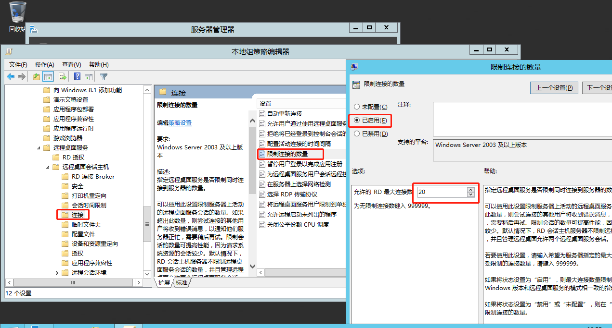
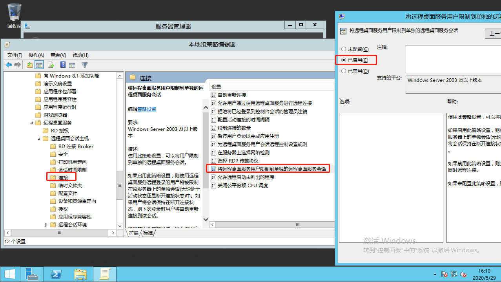
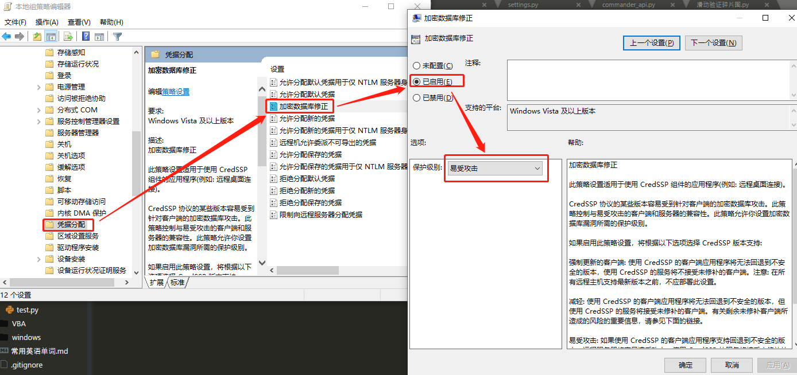
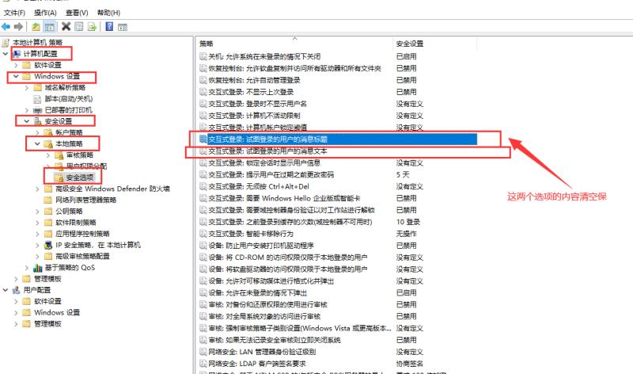
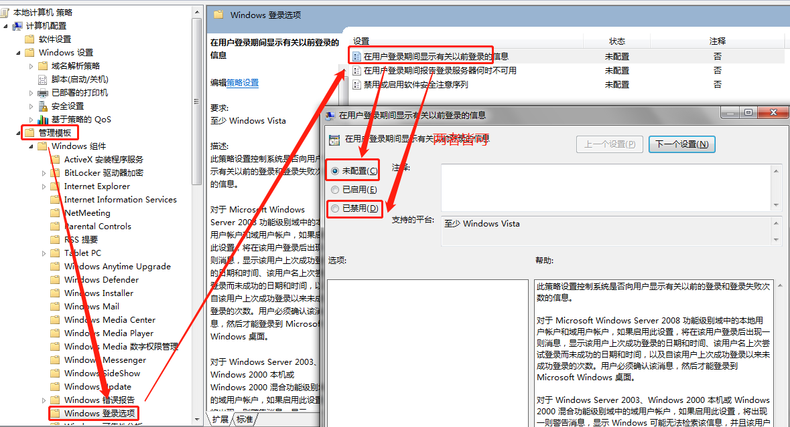

+ ####添加用户

    admin001

    admin002

+ ####将用户设置为可远程访问
    
    


+ ####关闭防火墙或自己写入站规则或者如下

    

+ ####gpedit.msc
    + 计算机配置—>管理模板—>windows组件—>
        远程桌面服务—远程桌面会话主机—连接
    

    
    


+ ####远程连接端需注意
    + 计算机配置—>管理模板—>系统—>
        凭据分配—>*数据库修正

    


+ ####Creater 测试代码
```js

user = 'admin001'
password = 'jiuguai_001'

// 程序执行错误。可以在LockScreen的第三个参数输入”/log-level:trace” 运行以后会在根目录下产生uibotrdp_stdout.txt以及uibotrdp_stderror.txt中检查出错信息

RDP.LockScreen(user,password,"/log-level:trace")
sRet = Sys.GetHomePath()
test_path = sRet & "\\desktop\\test.txt"

For i=0 To 30
    Delay 1000  // 这个根据测试需求调
    File.Append(test_path,user & i & "\n" ,"gbk")
Next

```


+ ####bot 测试代码
```js

//  参数更具worker 环境配置
user = Asset.GetAsset("jiuguaiuser")
password = Asset.GetAsset('jiguaiuser')

// 程序执行错误。可以在LockScreen的第三个参数输入”/log-level:trace” 运行以后会在根目录下产生uibotrdp_stdout.txt以及uibotrdp_stderror.txt中检查出错信息

RDP.LockScreen(user,password,"/log-level:trace")
sRet = Sys.GetHomePath()
test_path = sRet & "\\desktop\\test.txt"

For i=0 To 30
    Delay 1000  // 这个根据测试需求调
    File.Append(test_path,user & i & "\n" ,"gbk")
Next

```


+ #### UIBot 锁屏配置

    + 配置
        
        


        