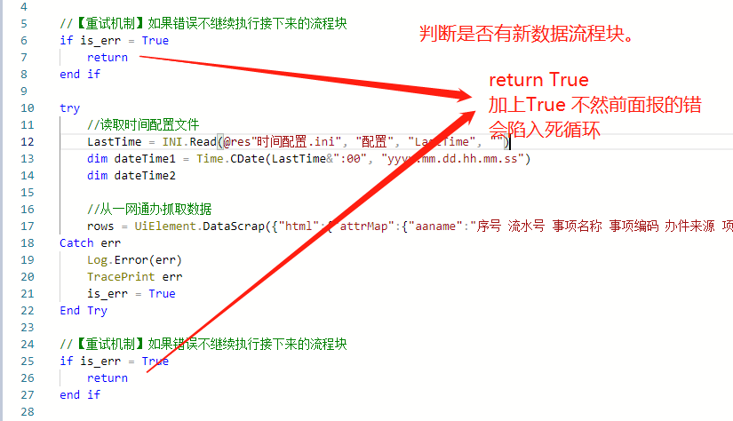

1. ## 风险

    1. 判断是否有最新数据流程块

        1. 前一条记录，使用的是精确到分钟的经办时间。
            
            建议：
                使用流水号判断。
                

        2. 要是我要的数据已经翻页，如何判断？
            
            建议：
                在抓取记录不为空的情况下，没有找到数据需要添加处理机制(要么调整pageSize,要么翻页)。
    
    2. 退出机制还未添加。
        1. 如果有些未知问题，导致频繁报错。但是你又在无限重试。
            建议：加上退出并发送通知，或者将关键信息写到制定目录下。

    

2. ##问题

    1. 账号密码放在了登录模块内。

        建议放在**初始化**模块中，后面账号多了。要么是带环境的参数获取，要么是任务参数获取。

    2. 判断是否有最新数据流程块.（会导致无法重试）
        
        

