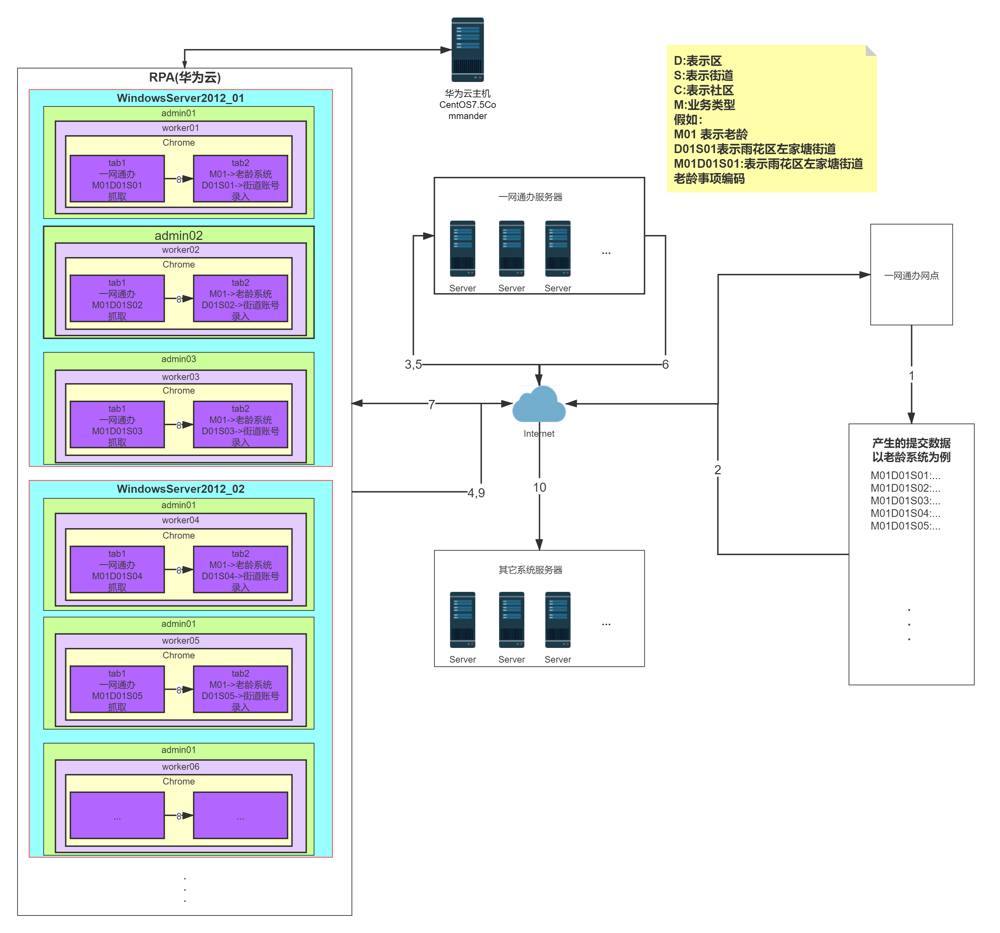

1. ### 关键词解释

    + **一网通办** 

        把政务数据归集到一个功能性平台，企业和群众只要进一扇门，就能办成不同领域的事项，解决“办不完的手续、盖不完的章、跑不完的路”等麻烦。

    + **其它系统**

        为了后续**方便描述**，将 湖南省老年管理系统（省级）、湖南省公共就业服务信息管理平台（省级）、国家卫生健康委员电子化注册信息系统（部级）、湖南省全员人口信息管理系统（省级）、湖南省社会保障卡管理系统（省级）、湖南省动物卫生监督网、湖南省道路运输三级协同管理系统（省级）、湖南省养老综合管理与服务平台（省级）这些系统 统一描述为**其它系统**。

    + **正向**

        数据由 从一网通办获取数据，录入到其它系统
    
    + **反向**

        数据由 从其它系统获取数据，录入到一网通办
    
    + **事项名称**
    
        某街道办理的办理的某种业务，街道+业务 组合成一个事项名称

    + **事项编码**
      
        事项名称的编码

2. ### 碎片

    + (1) 铺开范围9区一市
    
    + (2) 进入市政府大厅右手边的大屏幕，有个实时BI。
    
    + (3) 其他系统大多属于省级，并未将所有区域铺开。
    
    + (4) 根据2020-06-12 11点的腾讯会议得知，当前阶段，会出现一网通办与其他系统数据难以对齐的情况。这样的情况以**反向为主**。
    
            例如：失业登记中的常住地和意愿培训工种这两项录入，对数据的一致性要求很严。
                目前其中常住地需要录入的数据精确到了社区，而一网通办提供的只能精确到区。录入的地址采用的是目录树结构，需要保证地名名字一致才能保证RPA点选。

    + (5) 通过调试获取一网通办中的一条JSON数据。得知一网通办开发那边很忙，并且压力向前端倾泻。

    + (6) RPA 获取一网通办数据，发现没有相应的class或者ID或者隐性属性进行获取。而是通过大部分通过可能发生变化placeholder和少部分靠位置获取。可见开发那边忙碌程度。
      
	+ (7) RPA实施方案汇总一条信息：宁乡未使用一网通办系统，暂不列入试点区县
	
	+ (8) 正方向为主方向
	
    + (9) 目前正向录入如果出现难点，只有如下两种情况
        1. 数据对齐(主)
        2. RPA对老系统录入难以实施
    
3. ### 根据碎片的整理

    + **政府为什么想搞一网通办？**
      
        1. 便民，一扇门能办多个事项。
        2. 集中在一个系统上，方便实时查看动态，及时调整策略。(依据碎片(2))

    + **为什么需要解决二次录入?**
      	
      	1. 业务员在操作时候回将数据录入一网通办，在将同一份数据录一份到其它系统中。让业务员工作变得繁琐，耗时耗心力。
      	
      	2. 根据 落地实施事项清单中的年办件总量，解决**575286次**重复录入。假如手工同步一份数据平均需要1.5分钟。每年总共额外消耗14382小时。
      	
	+ **正向还是反向？**
		
        + **为什么要正向录入?**
          
            根据碎片(1,7,3),需要保证其它系统**数据完整性**。
        
        + **为什么要反向录入？（根据碎片(8) 既然正方向是正方向，为什么还要反方向）**
			
            根据碎片(4,5,6)得知，一网通办与其它系统某些事项很难正向对齐。
			又要保证一网通数据统一，所以反向。（依据碎片(2))
        
        + **结论**
        
			如果正向难，那么先反向。规定时间落地为主。（反向只是手段，正向才是目的)
        
	+ **根据现有的信息，推测一网通办的策略？** 

		1. 腾讯那边会先要求做正向。
		
		2. 实施过程中可能会出现两种可能性难点，会导致先采用反向。
			
			1. 正向内出现一网通办中的数据短时间无法与目标系统事项数据无法对齐。
			2. RPA不能实现正向的情况。

		3. 数据不能对齐的情况，后续会根据反向获取的数据和正向实施的难点进行方案制定，解决对齐问题。
		
        4. 对于RPA难以实施的情况。后续会采用其他途径正向。

		
4. ### 拓扑图(目标拓扑，以老龄为例，理想状态一台机能运行3台worker(未测))

		
		