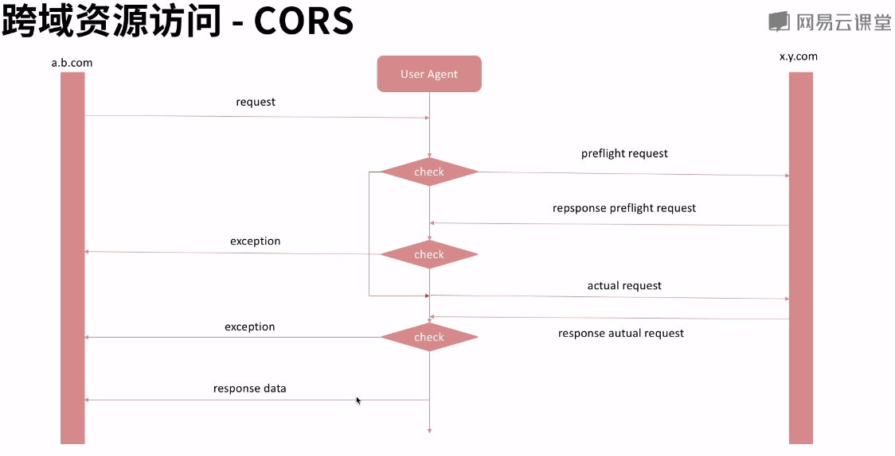
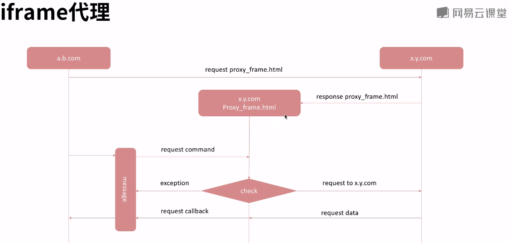

### web应用中资源缓存
>数据库缓存>服务器缓存>浏览器缓存>web应用缓存

### web应用缓存
+ HTTP Cookie
    + 应用
        + 回话状态管理
        + 个性化设置
        + 浏览器行为跟踪等
    + 缺陷
        + 4KB
        + 安全性(明文)
        + 流量代价
    + 替代品    
        + Web storage
        + IndexDB
    + Cookie 设置
        + document.cookie
    + Cookie格式
        + 字符串：name=value，不校验
        + expires：cookie过期时间
            + 过期时间，默认当前回话，UTC时间格式
        + domain：cookie将要被发送到的一个或一些域名
            + 默认 当前域，或子域
        + path：请求的资源中必须包含指定路径时，才发送cookie
        + secure：安全标记，没有值，https时生效

### 浏览器缓存
+ 使用HTTP请求头的相关字段，指示浏览器缓存策略
+ 为什么要缓存
    + 减少网络带宽消耗 
    + 减少服务器压力
    + 减少网络延迟，提升页面打开速度
+ 缓存规则
    + 新鲜度：缓存副本有效期，过期策略 
    + 校验值：验证校验标识Etag，验证策略
+ 使用方法                
    + HTML Meta 标签
    + HTTP消息报头
        + 通用
            + Pragma(HTTP/1.0)
        + 请求头
            + Cache-control(常见)(HTTP/1.1)
                + no-cache(常见)：不使用缓存
                + no-store：不会被保存到缓存
                + max-age=delta-seconds(常见)：接收一个age不大于delta-seconds秒的资源
                + max-stale[=delta-seconds]：告诉服务器客户端可以接受一个超过delta-seconds秒的资源
                + min-fresh"="delta-seconds：接收一个在小于delta-seconds秒内被更新的资源
                + no-transform：获取实体数据没被转换过的资源
                + only-if-cached：如果有缓存，则获取缓存内容
                + cache-extension：自定义扩展值
            + If-Match： Etage是否一致
            + If-None-Match： Etage是否不一致
            + If-Modified-Since： 资源最后跟新时间是否一致
            + If-unmodified-Since： 资源最后跟新时间是否不一致
        + 响应头
            + Etag：用于缓存校验的值
            + Cache-control(常见)(HTTP/1.1)
                + public(常见一般不会设置)：任何情况下都要缓存该资源
                + private： 指定字段给特定用户使用
                + no-cache(常见)：不使用缓存(可指定字段)
                + no-store：不会被保存到缓存
                + max-age=delta-seconds(常见)：接收一个age不大于delta-seconds秒的资源
                + s-max-age=delta-seconds:同上 仅用于共享缓存
                + no-transform：获取实体数据没被转换过的资源
                + must-revalidate：当前资源必须向服务器端发验证请求，若失败则返回504
                + proxy-revalidate：同上 仅用于共享缓存
                + cache-extension：自定义扩展值
        + 实体首部
            + Expires(HTTP/1.0) ：资源过期时间(UTC)
            + Last-Modified：资源最后一次修改时间

---

### 状态码(常见)
|分类|状态码|含义|释意|
|---|---|---|---|
|1xx|101|Switching Protocols|协议转换|
|2xx|200|ok|请求成功|
|3xx|301|Moved Permanently|已经移除|
||302|Found|发现临时资源|
||304|Not Modified|数据未发生改变|
|4xx|400|Bad Requests|错误的请求|
||403|Forbidden|不被允许访问|
||404|Not Found|未找到|
||405|Method Not Allowed|请求方式不被允许|
||413|Request Entity Too Large|请求体过长|
||415|Unsupported Media Type|媒体类型是服务不支持的|
|5xx|500|Internal Server Error|服务端错误|
||502|Bad Gateway|网关错误|
||503|Service Unavailable|服务不可用|
||505|Gateway Time-out|网关超时|


### HTTP/2
+ 提升1.1 的性能
+ 将HTTP/1.x 消息分成帧并嵌入到流中
+ 数据帧和报头帧分离，允许报头压缩
+ 可多路复用

### Ajax
+ XHR：XMLHttpRequest
+ XHR 实例化
    + new XMLHttpRequest()
    + 方法
        + open(method,url,async,username,password)
            + 初始化请求
            + 参数
                + method 方法，GET/POST/DELETE/HEAD/OPTIONS/PUT
                + url：地址
                + async :是否异步
                + username：
                + password
        + setRequestHeader(header,value)
            + 设置请求头消息
        + send(data)
            + 发送数据
            + 参数
                + data : String/FormData
    + 属性
        + readyState
        + onreadystatechange
        + response
            + "" ：默认，字符串
            + "arraybuffer"：HEADERS_RECEIVED
            + "blob"：document
            + "json"：json
            + "text"：字符串
        + responseType
        + status :响应状态码
        + statusText :响应状态信息
        + upload：可以在upload上添加一个时间监听来跟踪上传过程
    
    + 跨域访问
        + CORS(Cross Origin Resource Sharing)
            
        + iframe 代理
            
            + message
            + window.name
            + document.domain
        + JSONP
            + 原理
                + script可以跨域
                + 请求一段js代码
            + 限制
                + GET  


    + code

```js
    var xhr = new XMLHttpRequest()
    xhr.onreadystatechange = function(callback){
        if(xhr.readState == 4){
            if(xhr.status>=200 && xhr.status<300 || xhr.status == 304){
                callback(xhr.responseText)
            }else{
                console.error("request failed with status:" + xhr.status)
            }
        }
    }
    xhr.open('get','example.com',true)
    xhr.setRequestHeader('User-Agent',"Chrome")
        xhr.send(null)
```


+ WebSocket
    + 实例化
        + ws = new WebSocket(in DOMString url,inoptional DOMString protocols)
            + 参数
                + url:表示要连接的url
                + protocols:协议名字字符串或数组，表示子协议，默认为空
            + 异常
                + SECURITY_ERR
                    + 试图连接的端口被关闭
    + 方法
        + ws.close([code,[reason]])
            + 关闭WebSocket 连接停止正在进行的连接请求
            + 参数
                + code：可选，关闭连接的状态号，默认1000(正常关闭)
                + reason：可选，字符串，表示连接关闭的原因
            + 异常
                + INVALID_ACCESS_ERR
                    + 无效的code
                + SYNTAX_ERR
                    + reason字符串太长或不何方
        + ws.send(data)
            + 通过WebSocket 连接想服务器发送数据
            + 参数
                + data：发送数据
            + 异常
                + INVALID_STATE_ERR
                    + 当前的连接状态不是OPEN
                + SYNTAX_ERR
                    + 数据中包含Unpaired surrogates(非法数据)
    + 属性

        |属性名|类型|描述|
        |---|---|---|
        |binaryType|string|传输二进制类型，blob/arrayBuffer|
        |bufferedAmount|long|调用send方法后，队列中等待数据的大小，发送完后置为0，只读|
        |extensions|string|服务器选定的扩展|
        |onclose|EventListener|监听close事件|
        |onerror|EventListener|监听error事件|
        |onmessage|EventListener|监听message事件，消息到达时事件会触发|
        |onopen|EventListener|监听连接打开事件，readyState为OPEN时会触发|
        |protocol|string|表明服务器选定的子协议字符串|
        |readyState|short|连接的当前状态，只读|
        |url|string|传入构造器的url，只读|
    

    + 部署Web Socket服务器
        + Node.js
            + Socket.IO
            + WebSocket-Node
            + ws

        + JAVA
            + Jetty
        + Ruby
            + EventMachine
        + python
            + pywebsocket
            + ...

    + example
    
```js
        var ws = new WebSocket('wss://echo.websocket.org')
        ws.onopen = function(evt){
            console.log('Connection open ...')
            ws.send('Hello WebSockets!')
        }
        ws.onmessage = function(evt){
            console.log('Received Message: ' + evt.data)
            ws.close()
        }
        ws.onclose = function(evt){
            console.log('Connection closed.')
        }

```

+ Web Messaging
    + 一种文档中独立的浏览上下文间的数据分享方式，且不会有DOM被暴露给恶意的跨站脚本的尾箱
    + 浏览上下文
        + 将Document对象呈现给用户的环境
        + 例如标签、窗口、iframe等
    + 跨文档通信(Cross-document messaging)
        * message对象
            * 属性

                |属性(只读)|定义|
                |---|---|
                |data|message的数据|
                |origin|message的源，包含协议、域名及端口|
                |lastEventId|当前消息事件的唯一标识符|
                |source|原始文档窗口的应用，WindowProxy对象|
                |ports|MessagePort对象的数组|

        * 文档之间互相通信
            * otherWindow.postMessage(message,targetOrigin,[transfer])
                * otherWindow 窗口的引用
                * 参数
                    * message : 发送的内容
                    * targetOrigin：定义哪些源可以接收消息
                    * transfer：与message同时发送，这些对象的所有权一觉给target
                * 执行后抛出message事件
        * 安全性
            * 没有必要，不要监听message
            * 使用origin 和 source 属性校验发送方的身份
            * 使用postMessage时始终指定精确的target
    + 通道通信(Channel Messaging)
        + 利用消息同道，直接进行双向浏览上下文之间的通信手段
        + MessageChannel对象
            + 构造函数
                + mc = new MessageChannel()
                    + 返回一个带有2个MessagePort属性的MessageChannel新对象
                    + 实际上创建了2个互相关联的端口，一个发送端，另一个转发到其他浏览上下文
            + 属性
                + mc.port1
                + mc.port2
            + MessagePort
                + 方法
                    + mc.port.postMessage()
                        + 发送消息
                    + mc.port.start
                        + 开始在端口上分派消息
                    + mc.port.close
                        + 关闭端口
                    + mc.port.onmessage
                        + event handler